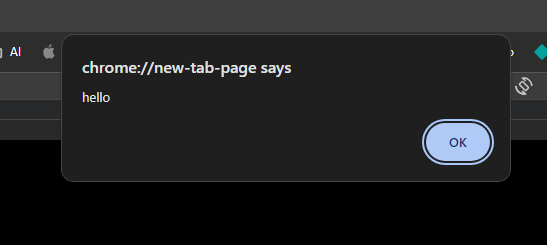
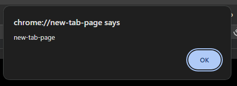
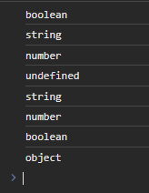
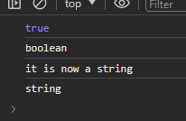
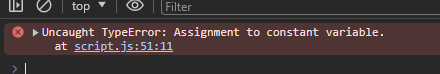

# Notes for JavaScript

### JavaScript embedded to HTML

Alert is used to force a pop up window in the browser.

```JS
alert("Hello world!")
```



or use following to return the url

```js
alert(location.hostname);
```



<br>
<br>

Using it in embedded HTML (has to be the element before all other tags start closing). It is important to wrap the if condition in ( ) and the instructions to follow in curly brackets { }.

```html
<script>
	let((javascript = "good"));
	if (javascript === "good") {
		alert("js is good");
	}
</script>
```

This will output the math operation into the browser console.

```html
<script>
	let javascript = "good";
	if (javascript === "good") {
		alert("js is good");
	}

	console.log(10 + 31 - 1);
</script>
```

<br>

### Values and variables

declaring a variable:

```js
let var1 = "john";
let var2 = 89;
```

### Data types

```js
// number: floating point, for decimals and integers
let age = 23;

// string
let firstName = "Engin";

// boolean
let fullAge = True;

// undefined, variable exists with no value assigned to it
let children;

// null/empty value
Null;

// unique value for visual representation
Symbol;

// numbers that are tpp large to be used by the number data type
BigInt;
```

you can use the typeof function to retrieve the data type of parameter being passed the following will return:

```js
let booleanVariable = true;
let stringVariable = "this is a string";
let numVariable = 234;
let undefinedVariable;

console.log(typeof booleanVariable);
console.log(typeof stringVariable);
console.log(typeof numVariable);
console.log(typeof undefinedVariable);

console.log(typeof "string example");
console.log(typeof 234);
console.log(typeof false);

// unique object type for null
console.log(typeof null);
```

this:

<br>

to reassign a value or datatype into an existing variable, you reassign the value to it:

```js
let boolVar = true;
console.log(boolVar);
console.log(typeof boolVar);

boolVar = "it is now a string";
console.log(boolVar);
console.log(typeof boolVar);

// you do not need to use let as it was already created as a variable, so you only need to reassign the value, not declare it again.

// referred to as mutating the age variable
```



<br>

let allows you to assign or mutate the value of a variable through out the program. if a variable is not meant to change its value or type, you use the const modifier when declaring it, rendering them immutable.

```js
// declaring as constant
const birthYear = 2003;

// trying to change the constant var
birthYear = 2005;

// declaring a constant variable without assigning:
const birthYear;
```

you get an error, i.e. in the web console:



<br>

prior to ES6 you were able to use "var" to declare variables. although they are similar in the basic functionality there is differences in how the variables are treated depending on the declaration
const and let are block scoped & var is function scoped (only retained with the func itself).

```js
// Example using var (function-scoped)
var job = "programmer";

// Example using let (block-scoped)
let age = 25;

// Example using const (block-scoped)
const PI = 3.14;
```

<br>

### Operators

allows you to manipulate, combine, compare transfer etc values.

#### arithmetic operators

```js
// take x = 5 and y = 3
const x = 5;
const y = 2;

// addition
console.log(x + y);

// subtraction
console.log(x - y);

// multiplication
console.log(x * y);

// exponentiation
console.log(x ** y);

// division
console.log(x / y);

// division with remainder
console.log(x % y);

//different types of pre/post inc/decrements
let x = 5;
let y;
// pre increment, increases x by 1 and makes y equal to the updated x
// returns x = 6, y = 6
y = ++x;
console.log("x is", x);
console.log("y is", y);

// pre decrement, decreases x by 1 and makes y equal to the updated x
// returns x = 4, y = 4
y = --x;
console.log("x is", x);
console.log("y is", y);

// post increment, increasing x by 1 but y still holds the original value of x
// returns x = 6, y = 5
y = x++;
console.log("x is", x);
console.log("y is", y);

// post decrement, decreasing x by 1 but y still holds the original value of x
// returns x = 4, y = 5
y = x--;
console.log("x is", x);
console.log("y is", y);
```

#### Assignment operators

these are shorthand ways to express a majority of the arithmetic operators

```js
// let x = 10 and y = 5

x = y;
// returns x = 5

x += y;
// returns x = 15

x -= y;
// returns x = 5

x *= y;
// returns x = 50

x /= y;
// returns x = 2

x %= y;
//returns x = 0
```

#### comparison operators

```js
// comparing less than greater than
const x = 5;
const y = 10;
x > y; // returns false in console
x < y; // returns true in console

x <= 5; // returns true
x >= y; // returns false
```

#### extra

```js
// using variables
// can be used with different operators
const enginBirth = 2003;
const currentYear = 2024;
const ageEngin = currentYear - enginBirth;
// returns 21
```

```js
// you can chain conditions and operators too
const enginBirth = 2003;
const currentYear = 2024;
const ageEngin = currentYear - enginBirth;
const isFullAge = ageEngin >= 20;
console.log(isFullAge); // returns true
```

Operation precedence follows BIDMAS, and go from left to right when calculating.

1. Brackets
2. Indices/Powers
3. Division/Multiplication
4. Addition/Subtraction

There are also directions to follow, regarding assignments, indices etc. More detail available at:
https://developer.mozilla.org/en-US/docs/Web/JavaScript/Reference/Operators/Operator_precedence

```js
let x, y;
x = y = 25 - 10 - 5;
// this returns x = 10 and y = 10
// assignments in JavaScript go right-to-left, so the right side is calculated first, following its relative order, and then goes left, into assigning the value to the variables.
```

### Additional Notes

##### Notation

JavaScript uses camel case by convention
you can put $ or \_ in front of variables if they are reserved
constants that will never be edited are denoted in all CAPS, VSCode recognizes this and marks it in a different color to normal variables

<br>

JavaScript has dynamic typing, does not require manual declaration of data types when declaring variables as it does this automatically

```

```
