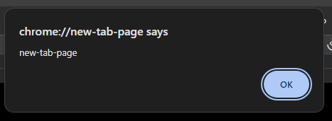

# Notes for JavaScript syntax

Alert is used to force a pop up window in the browser.

```JS
alert("Hello world!")
```


or use following to return the url

```js
alert(location.hostname);
```



<br>
<br>

Using it in embedded HTML (has to be the element before all other tags start closing). It is important to wrap the if condition in ( ) and the instructions to follow in curly brackets { }.

```html
<script>
	let((javascript = "good"));
	if (javascript === "good") {
		alert("js is good");
	}
</script>
```

This will output the math operation into the browser console.

```html
<script>
	let javascript = "good";
	if (javascript === "good") {
		alert("js is good");
	}

	console.log(10 + 31 - 1);
</script>
```
