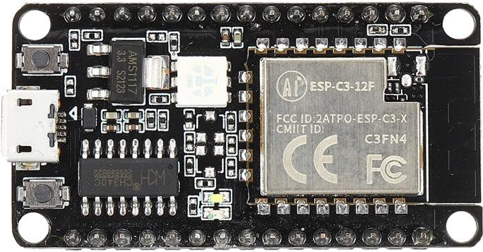
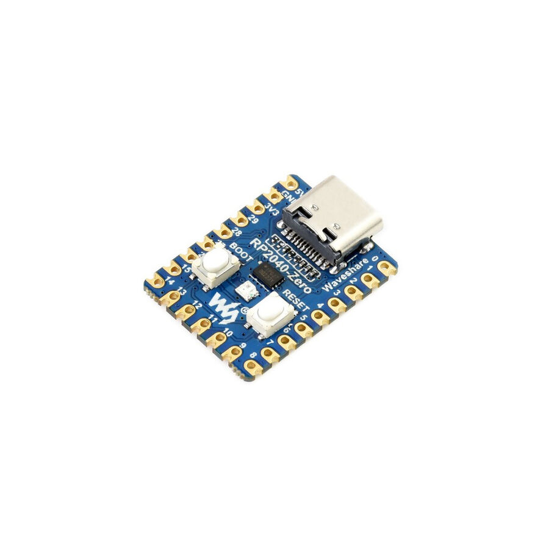

## Controlling LedBar using radio frequency remote

- it all circles to 433MHz rf remote and arduino?
- arduino nano's seem to be used
- hard to avoid using 2 mcu's?
- you need transmitter and receiver (rf)
- ir led and ir receiver alternatively?

### thinking/ideas

- wire receiver&transmitter to the respective arduino's
- similar to what we do with the esp32 before the nodeJS, use signal to trigger leds directly

---

- use existing connection pairs and search how to trigger them?

---

- use the full receiver/transmitter set to communicate, have 3 set states
- red, green, off
- as the relay uses 12v, and the leds use 12v (assuming there is a dedicated color led strip that works with 12v)
- no need for a transformer or components to manipulate voltage, can use one power line
- use 2 different led lines, one set to red, one set to green - would need dedicated led strips that are hard set to red and green

##### src

https://www.youtube.com/watch?v=4QZATgYaFmE&t
https://www.youtube.com/watch?v=Na-HthCeSOs

without micro controller
https://www.youtube.com/watch?v=7_7jkeRIpkQ

#### parts

##### communication:

full receiver transmitter set (12V so works with leds well)
https://www.direnc.net/433-mhz-mini-alici-verici-set-2ch-10a
{width="200px" height="auto"}

receiver _out of stock_
https://www.direnc.net/433mhz-rf-modul-alici
{width="200px" height="auto"}

alternative receiver:
https://www.direnc.net/433mhz-rf-trimerli-alici-rws-371
{width="200px" height="auto"}

transmitter
https://www.direnc.net/433mhz-rf-modul-verici
{width="200px" height="auto"}

##### smaller mcu list:

24.0x16.0mm - esp32 c3 12f
https://www.direnc.net/esp-c3-12f-4mb-wifi-bluetooth-modulu
{width="200px" height="auto"}

22.0x17.8mm - esp32 c3
https://www.direnc.net/esp32-c3-stemma-qt-wifi-gelistirme-karti
{width="200px" height="auto"}

18.0x23.5mm - raspberry pi 2040
https://www.direnc.net/raspberry-pi-rp2040-tabanli-mini-gelistirme-karti
{width="200px" height="auto"}

##### buttons

for red light
https://www.direnc.net/dc184-kirmizi-buton
{width="200px" height="auto"}

for green light
https://www.direnc.net/dc184-yesil-buton
{width="200px" height="auto"}

green light 2
https://www.direnc.net/12x12-yesil-led-isikli-tact-switch
{width="200px" height="auto"}

red light 2
https://www.direnc.net/12x12-kirmizi-led-isikli-tact-switch
{width="200px" height="auto"}

##### leds

green single color led strip
https://www.ledfon.com/urun/12v-uc-cip-ic-mekan-serit-led-yesil
{width="200px" height="auto"}

red single color led strip
https://www.ledfon.com/urun/12v-uc-cip-ic-mekan-serit-led-kirmizi
{width="200px" height="auto"}
