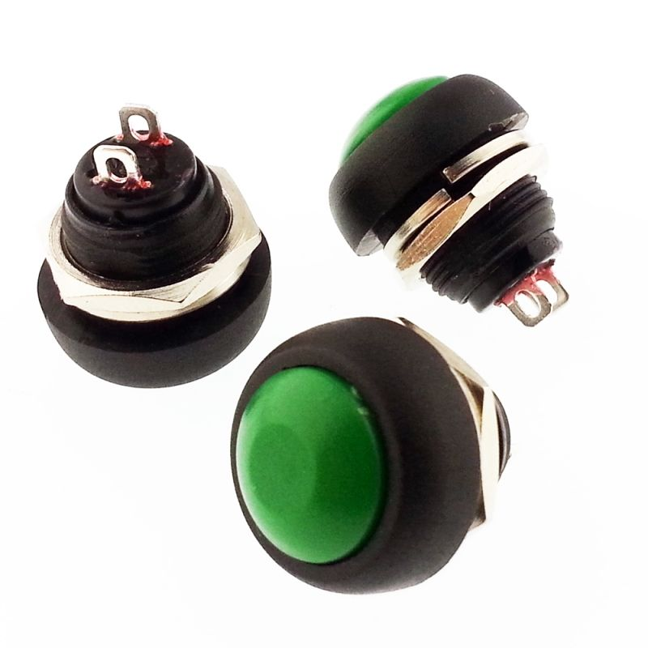

## Controlling LedBar using radio frequency remote

- it all circles to 433MHz rf remote and arduino?
- arduino nano's seem to be used
- hard to avoid using 2 mcu's?
- you need transmitter and receiver (rf)
- ir led and ir receiver alternatively?

### thinking/ideas

- wire receiver&transmitter to the respective arduino's
- similar to what we do with the esp32 before the nodeJS, use signal to trigger leds directly

---

- use existing connection pairs and search how to trigger them?

---

- use the full receiver/transmitter set to communicate, have 3 set states
- red, green, off
- as the relay uses 12v, and the leds use 12v (assuming there is a dedicated color led strip that works with 12v)
- no need for a transformer or components to manipulate voltage, can use one power line
- use 2 different led lines, one set to red, one set to green - would need dedicated led strips that are hard set to red and green

---

#### Flow for set led strip

---

#### Flow for one led strip

---

#### component table

| Name & Size                     | Image                                                  |
| ------------------------------- | ------------------------------------------------------ |
| 24.0x16.0mm - esp32 c3 12f      | {width="150px" height="auto"} |
| 22.0x17.8mm - esp32 c3          | {width="150px" height="auto"} |
| 18.0x23.5mm - raspberry pi 2040 | {width="150px" height="auto"} |
| receiver                        | {width="150px" height="auto"}  |
| receiver transmitter relay set  | {width="150px" height="auto"}  |
| receiver (out of stock)         | {width="150px" height="auto"}  |
| alternative receiver option     | {width="150px" height="auto"}  |
| red button 1                    | {width="150px" height="auto"}  |
| red button 2                    | {width="150px" height="auto"} |
| green button 1                  | {width="150px" height="auto"}    |
| green button 2                  | {width="150px" height="auto"}  |
| red led strip                   | {width="150px" height="auto"} |
| green led strip                 | {width="150px" height="auto"} |

---

##### src

https://www.youtube.com/watch?v=4QZATgYaFmE&t
https://www.youtube.com/watch?v=Na-HthCeSOs

without micro controller
https://www.youtube.com/watch?v=7_7jkeRIpkQ

---

##### links

https://www.direnc.net/esp-c3-12f-4mb-wifi-bluetooth-modulu
https://www.direnc.net/esp32-c3-stemma-qt-wifi-gelistirme-karti
https://www.direnc.net/raspberry-pi-rp2040-tabanli-mini-gelistirme-karti

https://www.direnc.net/433-mhz-mini-alici-verici-set-2ch-10a
https://www.direnc.net/433mhz-rf-modul-alici
https://www.direnc.net/433mhz-rf-trimerli-alici-rws-371
https://www.direnc.net/433mhz-rf-modul-verici

https://www.direnc.net/dc184-kirmizi-buton
https://www.direnc.net/dc184-yesil-buton
https://www.direnc.net/12x12-yesil-led-isikli-tact-switch
https://www.direnc.net/12x12-kirmizi-led-isikli-tact-switch
https://www.ledfon.com/urun/12v-uc-cip-ic-mekan-serit-led-yesil
https://www.ledfon.com/urun/12v-uc-cip-ic-mekan-serit-led-kirmizi
